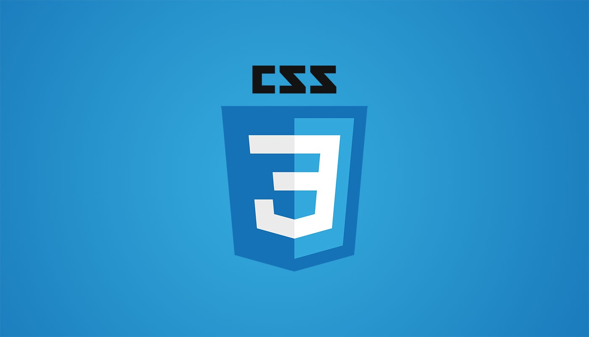

# Custom Style Editor

Take a look at this new CSS editor that I created for our dashboard at Periodic. It allows users to choose any color from a color picker and any font from over 1000 Google Fonts to apply to a booking site. It also allows users to fine-tune specific styles within an integrated style editor. In the accompanying video, I have a booking site for meeting with Batman characters where I change the styles from a standard-looking site to one that looks more like it might fit within the Batman universe. This new feature is pretty cool, but I think the way that I implemented it is even more interesting.

<iframe width="560" height="315" src="https://www.youtube.com/embed/avdiyLmhaes" title="YouTube video player" frameborder="0" allow="accelerometer; autoplay; clipboard-write; encrypted-media; gyroscope; picture-in-picture" allowfullscreen></iframe>


I work in a codebase that uses AngularJS with the app written entirely in CoffeeScript. With both of these technologies starting to show their age, we've decided to transition to React & Typescript.  It isn't realistic for us to hunker down and rewrite everything all at once, so the idea is to roll out new features using modern technologies to reduce the amount of time it would take to fully transition to React + Typescript. 

How do we do this? There are projects like
[ngReact](https://github.com/ngReact/ngReact), however, that requires additional
buy-in to the AngularJS paradigm of adding JavaScript inside of HTML vs. the
React paradigm of working with HTML inside JavaScript. I was inspired by [this
talk](https://www.youtube.com/watch?v=2rhkgB8Cohc) that Michael Jackson gave a
few years ago about his unpkg project. Unpkg is billed as a "fast, global
content delivery network for everything on NPM." It effectively gives you access
to most packages on NPM with nothing more than putting a script tag in your HTML
document. Because AngularJS does not have support for native ES Modules, this
seemed to be an ideal way of bootstrapping React into our application. Doing
this turned out to be pretty simple. We add these script tags to our root html
doc: 

```html
<script crossorigin src="https://unpkg.com/react@17/umd/react.production.min.js"></script>
<script crossorigin src="https://unpkg.com/react-dom@17/umd/react-dom.production.min.js"></script>
```

Then to our Angular template, we add an empty div with an id that will be referenced by our React app, which would look something like this: 

```html
<div id="initReact"></div>
```

Finally, inside of the Angular controller, we initialize the React app like this:

```jsx
function initReact () {
      return setTimeout(function () {
			ReactDOM.render(<App />, document.getElementById("initReact"));
      });
    };
```

Then we call this function right from our `$onInit` live cycle hook inside the Angular controller. You may have noticed that everything is wrapped inside a `setTimeout` callback. Doing this kicks the initialization of our React component into the Callback Queue before entering the call stack. This ensures that we load the React portion of our application after the rest of our AngularJS app is initialized. I recently discovered [this great little website](http://latentflip.com/loupe/?code=JC5vbignYnV0dG9uJywgJ2NsaWNrJywgZnVuY3Rpb24gb25DbGljaygpIHsKICAgIHNldFRpbWVvdXQoZnVuY3Rpb24gdGltZXIoKSB7CiAgICAgICAgY29uc29sZS5sb2coJ1lvdSBjbGlja2VkIHRoZSBidXR0b24hJyk7ICAgIAogICAgfSwgMjAwMCk7Cn0pOwoKY29uc29sZS5sb2coIkhpISIpOwoKc2V0VGltZW91dChmdW5jdGlvbiB0aW1lb3V0KCkgewogICAgY29uc29sZS5sb2coIkNsaWNrIHRoZSBidXR0b24hIik7Cn0sIDUwMDApOwoKY29uc29sZS5sb2coIldlbGNvbWUgdG8gbG91cGUuIik7!!!PGJ1dHRvbj5DbGljayBtZSE8L2J1dHRvbj4%3D) that helps visualize this process and I'd highly recommend you take a look and poke around. 

And that's it! When we visit the page in our Angular app that contains the `initReact` div, we will see and be able to interact with our React components.
